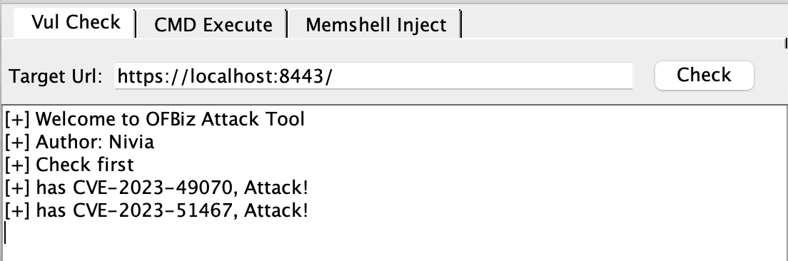
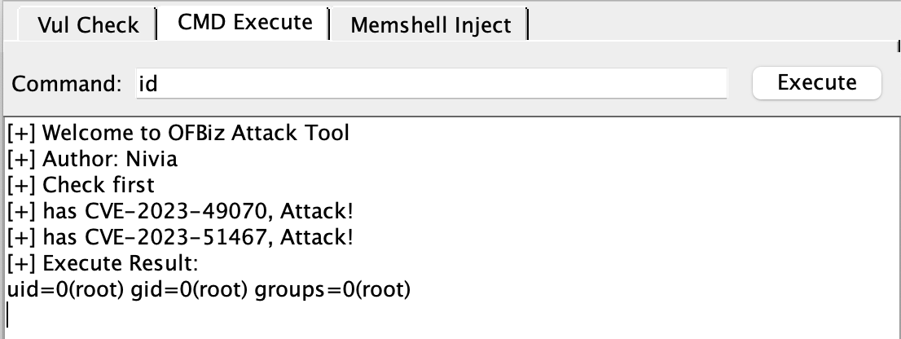
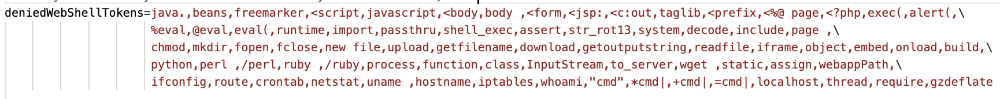
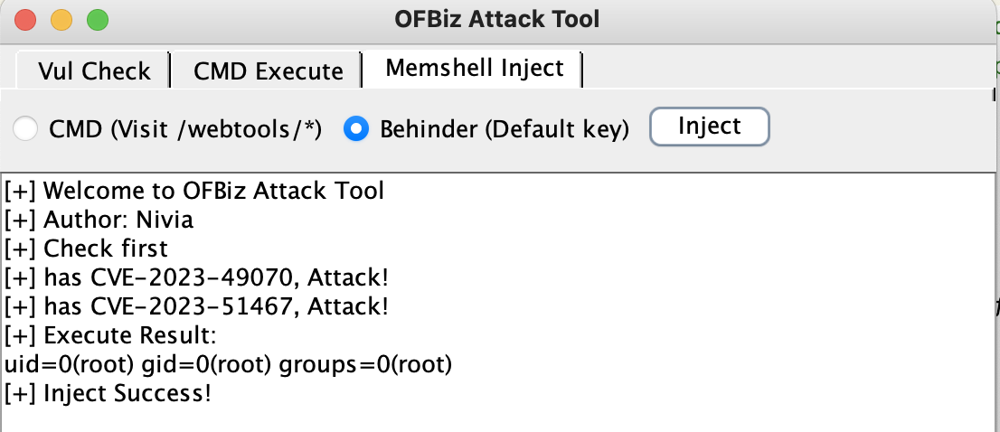
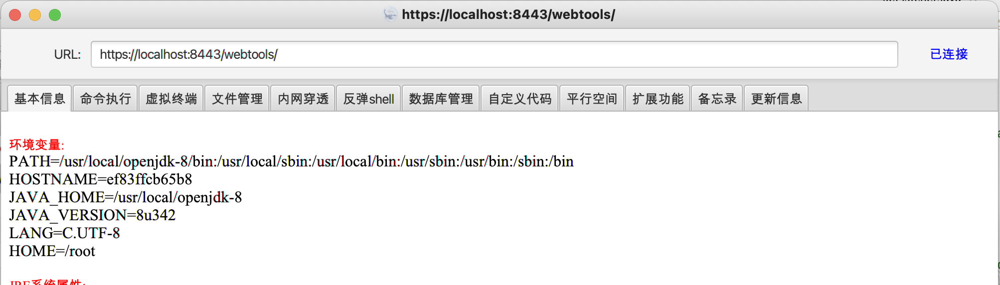

# OFBiz-Attack
A Tool For CVE-2023-49070/CVE-2023-51467 Attack

### 测试环境

vulhub/ofbiz:18.12.09

### 使用

启动

````
java -jar OFBiz-Attack.jar
````

共有三个模块，分别是：

- 漏洞检测

  

  仅输入目标URL即可，无限额外添加路由，否则影响后续模块利用。仅支持发送Https请求，运行速度取决于Web服务器性能

  验证完成后请勿修改URL，后续利用会从此框获取URL

- 命令执行

  使用前需完成漏洞校验，使用的是CVE-2023-51467来执行命令，也方便回显

  

  

  执行失败会返回Not executed for security reason信息

  部分命令无法执行原因是（可能是因为）security.properties文件中设置了黑名单

  

  但还是能执行到反弹shell，该模块体验不佳的话请移步下一个模块

- 注入内存马

  ⚠️慎用，伤害不可逆

  使用前需完成漏洞校验，使用CVE-2023-49070反序列化注入内存马，模块支持注入CMD/Behinder内存马，原则上只能注入一种

  

  

  连接Behinder，默认密码，不要忘记最后的`/`

  

  两种内存马都是注入到`/webtool/*`的Filter

### 结语

⚠️此工具仅用于学习交流，切勿用于非法用途

如果模块给你带来了不好的体验，在此深表歉意，还请为工具提出建议，后续进行改进🙏

感谢使用
